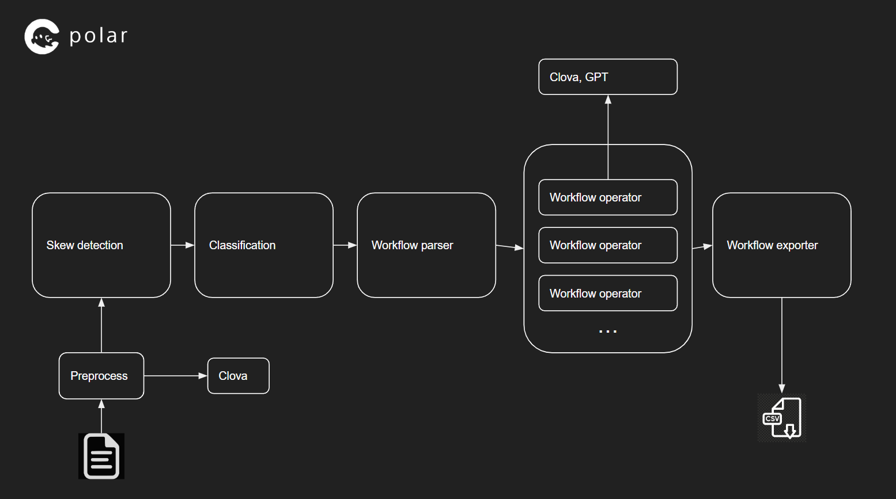

# polar
Person-like ocr system that leverages artifical intelligence to realize game changing OCR.

## What does it mean 'Person-like'?
Just imagine when you try to outsource document structuring work to freelancers on the internet. You can prepare some document or instruction by drawing some workflow and writing tips. **Same happen here!**

## How does this work
- Use Clova OCR to read texts and structure
- Use jdeskew and small algorithm to estimte skew
- Use simple algorithm to determine document class
- Use GPT-3 or Clova to extract information from document by workflow defintion
- Use csv to define exporting structure

## Engine

