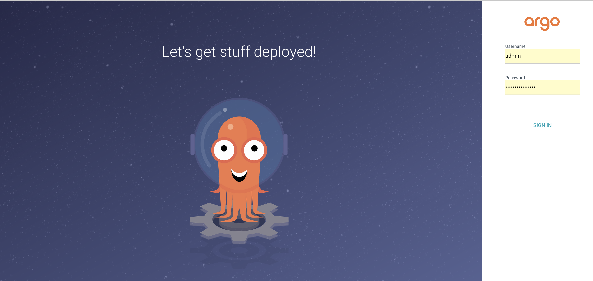

## hello world kubernetes cluster manifests!


## Connect ArgoCD DashBoard
### please this command then run argocd server
```shell
kubectl port-forward svc/argocd-server -n argocd 8080:443
```

### please access `localhost:8080`



ID：`admin`
Password: please this command

```shell
kubectl get secret argocd-initial-admin-secret -n argocd -o jsonpath='{.data.password}' | base64 -d
```